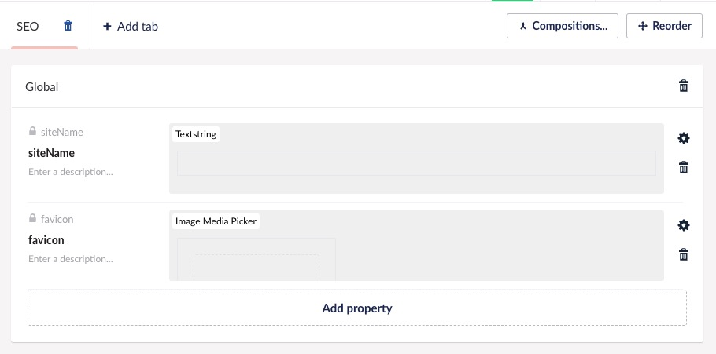
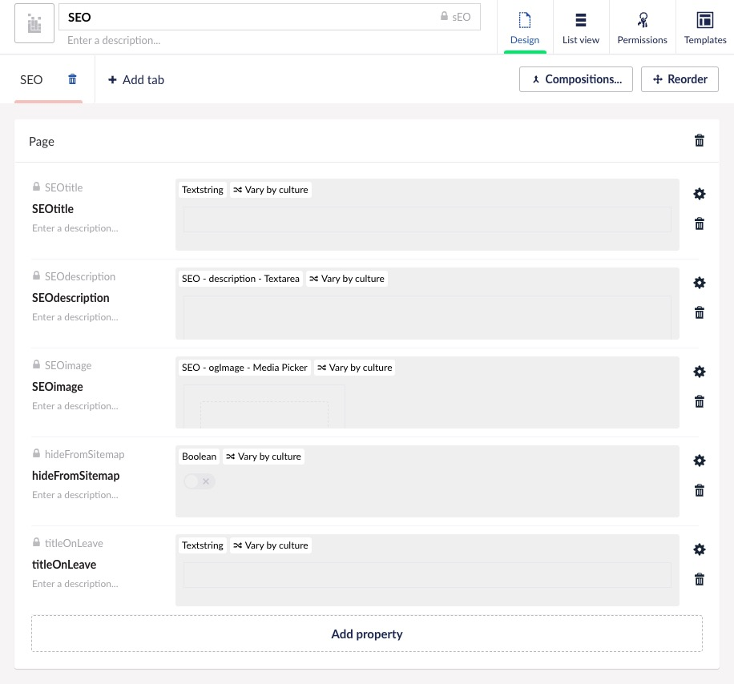

# Astro Umbraco Headless Starter

```sh
yarn create astro@latest -- --template aksellsor/aks_astro_template
npm create astro@latest -- --template aksellsor/aks_astro-template
```

## Live demo

[](https://aks-astro-template.pages.dev/)

## Edit

[](https://stackblitz.com/github/aksellsor/aks_astro_template/tree/main)
[](https://codesandbox.io/p/devbox/github/aksellsor/aks_astro_template/tree/main)
[](https://github.com/codespaces/new/aksellsor/aks_astro_template)

## 🚀 Features

- Multilingual support
- Page transitions by using Swup
- SEO
- Darkmode support

## 🚀 Project Structure

```text
/
├── public/
├── src/
│   └── umbraco-client.ts
│   └── utils.ts
│   └── components/
│       └── standard/
│   └── data/
│       └── translation.json
│   └── layouts/
│       └── Layout.astro
│       └── Root.astro
│       └── Page.astro
│   └── pages/
│       └── [...slug].astro
│       └── 404.astro
│       └── sitemap.xml.js
│       └── robots.txt.ts
└── package.json
```

## Umbraco Compositions

- [umbraco_compositions/globalSEO.udt](umbraco_compositions/globalSEO.udt)



- [umbraco_compositions/SEO.udt](umbraco_compositions/SEO.udt)


